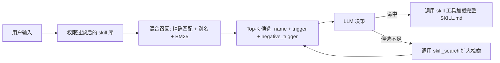

# SKILL 技能管理

## 目标

1. 有组织地管理海量 skill。
2. 提高 skill 命中率，避免一次性把所有 skill 都发给大模型。
3. 降低小参数量模型在大量 skill 描述中混淆、误选、漏选的概率。
4. 在召回失败时提供可观测、可扩展、可控的二次检索机制。

## 方案概述

采用“轻量召回 + LLM 决策 + 正文延迟加载”的两阶段模式：

1. 系统根据用户输入在本地 skill 库中召回少量高置信度候选。
2. Prompt 中只暴露候选 skill 的精简触发信息，不暴露完整 `SKILL.md` 正文。
3. LLM 判断是否需要使用某个候选 skill。
4. 如需使用，LLM 调用现有 `skill(name="...")` 工具读取完整说明。
5. 如果候选不满足需求，LLM 调用结构化的 `skill_search` 工具扩大检索范围。

### 整体流程



## 阶段一：候选召回

默认使用 BM25 作为离线轻量召回算法，但不建议只依赖 BM25。实际召回应采用分层策略：

1. **显式命中优先**：用户直接输入 `/skill-name`、skill 名称、command name、alias 时，直接召回对应 skill。
2. **精确/别名匹配**：对 `name`、`command_name`、`display_name`、`aliases` 做大小写归一和中英文符号归一。
3. **BM25 关键词召回**：在 `keywords` / `bm25_search_keywords` / `description` 上计算相关度。
4. **可选语义召回**：当 skill 数量很大、语言表达很口语化，或 BM25 分数普遍偏低时，可增加 embedding 或 LLM query rewrite。

召回结果进入 LLM 前必须先经过权限过滤：

- 不暴露 `disable_model_invocation=true` 的 skill。
- 尊重 `disabled_skills` 配置。
- 尊重项目 skill / 插件 skill 的启用开关和信任边界。
- 对同名 skill 继续沿用现有 registry 的覆盖顺序，避免召回到被覆盖的旧版本。

**Token 开销对比**：

| 方案 | 候选信息 | 预估开销 |
|------|----------|----------|
| 精简候选 | `skill_name + trigger + negative_trigger` | 约 200-500 Token |
| 完整正文 | 多个完整 `SKILL.md` | 可能数千至数万 Token |
| 工具 Schema 全量暴露 | 所有参数 Schema | 1500-2000+ Token，随 skill 增长 |

## 阶段二：LLM 决策

候选 skill 进入 prompt 时，只提供模型做选择所需的最小信息：

- `skill_name`
- `description` 或 `trigger`
- `negative_trigger`
- `source` / `trust_level`（可选，用于提示项目 skill、插件 skill 等来源）

模型判断规则：

1. 只有当用户需求明确落在 `trigger` 范围内，才调用 `skill` 工具加载完整内容。
2. 如果用户需求命中 `negative_trigger`，不得调用该 skill。
3. 如果多个候选都可能相关，优先选择最具体、约束最明确的 skill。
4. 如果候选列表不足以完成任务，调用 `skill_search` 继续检索，而不是凭空猜 skill 名称。

## 阶段三：Skill Miss 处理

Skill Miss 是指：**大模型理解了用户需求，但在当前候选 skill 中找不到合适技能**。

不建议使用 `<|SKILL_MISS|>` 这类自然语言哨兵作为主要机制。小模型可能忘记输出、输出变体，或者在普通文本中误触发。更稳的方案是提供一个只读工具：

```json
{
    "name": "skill_search",
    "description": "Search available skills when the current candidate list is insufficient.",
    "parameters": {
        "type": "object",
        "properties": {
            "query": {
                "type": "string",
                "description": "Keywords or short natural-language description of the needed skill."
            },
            "limit": {
                "type": "integer",
                "description": "Maximum number of additional skills to return.",
                "default": 10
            },
            "exclude_names": {
                "type": "array",
                "items": {"type": "string"},
                "description": "Skill names already shown to the model."
            }
        },
        "required": ["query"]
    }
}
```

Miss 后处理：

1. `skill_search` 使用 LLM 提供的 query 重新检索。
2. 默认排除已展示过的候选，避免重复给模型。
3. 根据分数返回 Top-10 或 Top-15。
4. 如果仍没有候选，明确告诉 LLM 当前没有可用 skill，继续使用普通能力和已有工具完成任务。

**注意**：API 超时、网络异常、模型无输出等不属于 Skill Miss，应按普通运行时异常处理。

## Skill 定义

当前 OpenHarness 已有 `SkillDefinition.description`，因此新字段应兼容现有字段，避免要求所有历史 skill 一次性迁移。

建议字段：

> **字段说明**：
> - `skill_name`: 技能唯一标识，通常对应现有 `command_name` 或 `name`。
> - `aliases`: 人类常用别名、缩写、命令变体。
> - `keywords`: 检索端关键词，面向 BM25 / 搜索引擎。
> - `trigger`: 推理端正向触发指南，说明什么时候应该使用。
> - `negative_trigger`: 推理端反向触发指南，说明什么时候不应该使用。
> - `requires`: 使用前置条件，如是否需要文件、数据、网络、特定 runtime。
> - `parameter_schema`: 执行端参数 Schema。对 markdown skill 可继续由 skill 正文定义，不必全部前置暴露。

示例：

```yaml
---
name: generate_chart
description: Generate charts from structured data.
aliases:
  - chart
  - plot
keywords:
  - 画图
  - 绘图
  - 趋势图
  - 折线图
  - 柱状图
  - 饼图
  - 可视化
  - chart
  - plot
  - graph
trigger: >
  当用户明确要求对已获取的结构化数据进行图形化展现时使用。
negative-trigger: >
  不用于无原始数据的场景；不用于生成艺术图片、照片或 UI 插画。
requires:
  - structured_data
---

# Generate Chart

完整 skill 指南继续放在正文中，由 `skill` 工具延迟加载。
```

兼容策略：

1. 若存在 `trigger`，候选列表优先展示 `trigger`。
2. 若不存在 `trigger`，使用现有 `description`。
3. 若不存在 `keywords`，从 `name`、`aliases`、`description`、正文首段生成检索文本。
4. 可保留 `bm25_search_keywords` 作为 `keywords` 的旧字段别名。

## 技术细节

### 索引构建与更新

**架构设计**：内存常驻倒排表 + 磁盘持久化快照双轨机制。

构建时机：

- 冷启动：系统启动时，从当前 registry 中加载所有可模型调用的 skill，构建检索索引。
- 热更新：当 skill 新增、删除或修改时，根据文件 mtime / 内容 hash 判断是否需要重建。
- 插件变化：插件启停、项目 skill 开关变化、`disabled_skills` 变化后必须重新过滤候选。

实现建议：

- 使用内容 hash 避免无意义重建。
- 索引重建采用新实例构建完成后原子替换，避免并发读到半成品。
- Debug 模式输出召回候选、分数、命中字段、过滤原因，方便排查误召回和漏召回。
- 不要承诺固定“微秒级”重建耗时；实际耗时取决于 skill 数量、文件 IO、插件扫描和分词策略。

### keywords 生成

初次使用时可以用 LLM 辅助生成，但生成结果应可审计、可编辑：

1. API 标准名称与变形，如 `fetch_stock`、`fetchStock`。
2. 功能同义词扩展，如“股价”“行情”“市值”。
3. 预测用户高频口语提问句式，如“帮我看看行情”。
4. 负向边界词，如 chart skill 不应被“画一张海报”触发。

### Top-K 策略

Top-5 可以作为默认值，但不应固定写死。建议按置信度动态调整：

- 高置信度：分数有明显断崖时返回 Top-3 到 Top-5。
- 中置信度：多个候选分数接近时返回 Top-8 到 Top-12。
- 低置信度：分数普遍偏低时返回少量候选，并提示模型可以调用 `skill_search`。
- 多意图任务：允许返回更多候选，但保持每个候选描述极短。

## 风险与边界

1. **漏召回风险**：BM25 对中文分词、同义词、口语表达敏感，必须保留二次搜索入口。
2. **误召回风险**：只有正向 trigger 会导致模型误用，应同时提供 `negative_trigger`。
3. **权限绕过风险**：检索层必须复用现有 skill registry 和配置过滤，不能直接扫磁盘后暴露所有 skill。
4. **提示注入风险**：项目 skill 和插件 skill 可能来自不完全可信来源，候选列表只展示元数据，正文必须继续通过受控 `skill` 工具延迟加载。
5. **同名覆盖风险**：同名 skill 需要遵循现有加载优先级，否则候选名和实际加载内容可能不一致。
6. **观测不足风险**：没有召回日志时，线上 miss 很难排查。必须记录 query、候选、分数、过滤原因和最终是否调用。
7. **沙箱降级风险**：代码沙箱不是普通 skill miss 的默认兜底，它会改变权限模型，必须单独设计隔离、超时、网络权限、文件权限和审计。

## 后续改进

1. **结构化 skill_search 工具**：优先实现，用于替代自然语言 `<|SKILL_MISS|>` 哨兵。
2. **夜间演化固化**：记录触发 skill miss、二次检索、最终成功完成的 execution traces，用于改进 keywords 和 trigger。
3. **候选评测集**：建立一组用户请求到期望 skill 的 golden cases，覆盖中文、英文、口语、多意图、负向触发。
4. **可选语义召回**：当 skill 数量扩大后，再引入 embedding 或 query rewrite，不作为第一阶段强依赖。
5. **沙箱降级单独设计**：仅在权限模型和审计能力完善后启用，不作为 skill miss 的默认行为。
